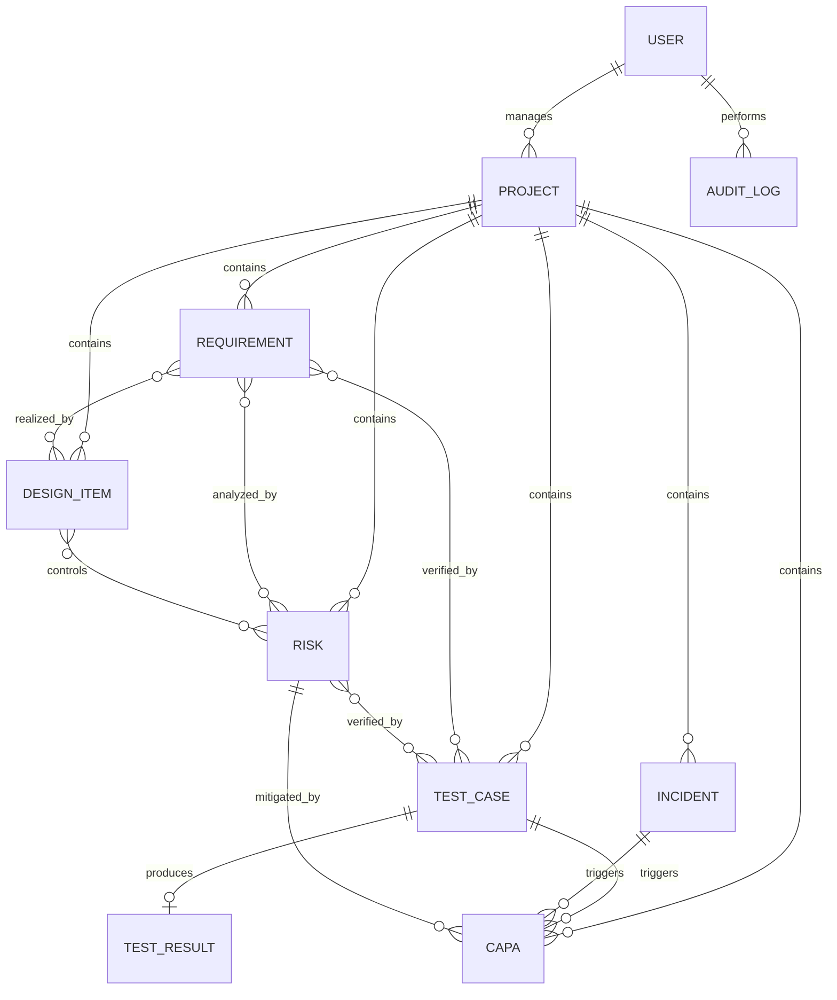

# MedTrace RA

의료기기 개발 과정의 요구사항, 설계, 위험, 시험, 이상사례, CAPA를 하나의 흐름으로 연결해 추적하는 Django 기반 RA(규제 대응) 관리 MVP입니다.

> 이 프로젝트는 학습 및 시연용입니다. 실제 의료기기 인허가, 의료적 판단 또는 규제 전문가의 검토를 대체하지 않습니다.

현재 버전: **1.0.0**

## 주요 기능

- 프로젝트별 요구사항·설계·위험·시험·이상사례·CAPA CRUD
- `REQ-001`, `DES-001`, `RISK-001`, `TEST-001`, `INC-001`, `CAPA-001` 형식의 자동 식별자
- 발생가능성과 심각도에 따른 위험 점수 및 위험 등급 계산
- 잔여 위험 점수와 수용 여부 관리
- 승인 요구사항의 시험 커버리지 계산
- 다음 추적성 누락 자동 탐지
  - 승인 요구사항과 시험의 미연결
  - 요구사항과 위험의 미연결
  - 시험 결과 미등록
  - FAIL 시험과 CAPA의 미연결
- 프로젝트 대시보드와 추적성 매트릭스
- DOCX, XLSX, PDF 추적성 보고서 출력
- 역할 기반 화면 및 REST API 접근 제어
- 관리자용 변경 요청 감사 로그
- 재현 가능한 데모 데이터 생성 명령

## 기술 구성

- Python 3
- Django 5
- Django REST Framework
- SQLite
- Django Template 및 정적 CSS
- `python-docx`, `openpyxl`, `reportlab`

기본 언어는 한국어이고 시간대는 `Asia/Seoul`입니다.

## 빠른 시작

### Windows PowerShell

```powershell
python -m venv .venv
.venv\Scripts\Activate.ps1
python -m pip install --upgrade pip
pip install -r requirements.txt
python manage.py migrate
python manage.py seed_demo_data
python manage.py runserver
```

브라우저에서 <http://127.0.0.1:8000>에 접속합니다.

### macOS / Linux

```bash
python3 -m venv .venv
source .venv/bin/activate
python -m pip install --upgrade pip
pip install -r requirements.txt
python manage.py migrate
python manage.py seed_demo_data
python manage.py runserver
```

## 데모 계정

`seed_demo_data`는 다음 계정과 예시 프로젝트를 생성합니다.

| 계정 | 비밀번호 | 역할 |
|---|---|---|
| `admin` | `MedTrace!2026` | 시스템 관리자 |
| `ra_manager` | `Demo!2026` | RA 항목 편집 |
| `developer` | `Demo!2026` | 요구사항·설계 편집 |
| `tester` | `Demo!2026` | 시험·결과 편집 |
| `viewer` | `Demo!2026` | 조회 전용 |

데모 명령은 기존 계정의 비밀번호도 위 값으로 초기화합니다. 실제 데이터가 있거나 외부에 공개된 환경에서는 실행하지 마세요.

## 역할과 권한

| 그룹 | 권한 |
|---|---|
| `ADMIN` | 전체 편집, 사용자 조회 API, 감사 로그 접근 |
| `RA_MANAGER` | 업무 데이터 조회 및 편집 |
| `DEVELOPER` | 업무 데이터 조회 및 편집 |
| `TESTER` | 업무 데이터 조회 및 편집 |
| `VIEWER` | 조회 전용 |

REST API는 인증된 사용자만 사용할 수 있습니다. 조회 요청은 모든 인증 사용자에게 허용되며, 변경 요청은 관리자 또는 편집 그룹에만 허용됩니다.

## 주요 화면

| 화면 | URL |
|---|---|
| 대시보드 | `/` |
| 프로젝트 | `/projects/` |
| 요구사항 | `/requirements/` |
| 설계 | `/items/designs/` |
| 위험 | `/risks/` |
| 시험 | `/tests/` |
| 이상사례 | `/incidents/` |
| CAPA | `/capa/` |
| 추적성 매트릭스 | `/traceability/` |
| 감사 로그 | `/audit/` |
| Django 관리자 | `/admin/` |

보고서는 `/export/xlsx/`, `/export/docx/`, `/export/pdf/`에서 내려받을 수 있습니다. `project` 쿼리 파라미터를 생략하면 첫 번째 프로젝트를 사용합니다.

## REST API

API 기본 경로는 `/api/`입니다.

| 기능 | 경로 |
|---|---|
| 로그인·로그아웃 | `/api/auth/login/`, `/api/auth/logout/` |
| 프로젝트 | `/api/projects/` |
| 요구사항 | `/api/requirements/` |
| 위험 | `/api/risks/` |
| 시험 | `/api/tests/` |
| 시험 결과 등록 | `/api/tests/{id}/result/` |
| 이상사례 | `/api/incidents/` |
| CAPA | `/api/capa/` |
| 추적성 | `/api/traceability/` |
| 추적성 누락 | `/api/traceability/gaps/` |
| 대시보드 요약 | `/api/dashboard/summary/` |
| 사용자 조회(관리자) | `/api/admin/users/` |

세션 인증과 Basic 인증을 지원합니다.

```powershell
curl.exe -u viewer:Demo!2026 http://127.0.0.1:8000/api/dashboard/summary/
curl.exe -u viewer:Demo!2026 http://127.0.0.1:8000/api/traceability/gaps/
```

## 데이터 관계



화면과 API는 동일한 Django ORM 모델 및 서비스 계산 로직을 사용합니다.

## 관리자 계정 생성

비밀번호를 저장소나 명령 기록에 남기지 않도록 환경 변수를 사용할 수 있습니다.

```powershell
$env:ADMIN_USERNAME = "admin"
$env:ADMIN_EMAIL = "admin@example.com"
$env:ADMIN_PASSWORD = "충분히-긴-비밀번호"
python manage.py create_admin
```

기존 사용자를 관리자로 승격하려면 다음 명령을 사용합니다.

```powershell
python manage.py promote_admin --username username
```

## 환경 변수

| 변수 | 기본값 | 설명 |
|---|---|---|
| `SECRET_KEY` | 개발용 키 | Django 비밀 키 |
| `DEBUG` | `True` | 디버그 모드 |
| `ALLOWED_HOSTS` | `127.0.0.1,localhost,testserver` | 허용 호스트 목록 |
| `MAX_UPLOAD_SIZE_MB` | `10` | 업로드 크기 제한 예약 값 |
| `ADMIN_USERNAME` | 없음 | 관리자 생성 명령용 계정 |
| `ADMIN_EMAIL` | 없음 | 관리자 생성 명령용 이메일 |
| `ADMIN_PASSWORD` | 없음 | 관리자 생성 명령용 비밀번호 |

`.env.example`에는 향후 확장용 값도 포함되어 있지만, 현재 애플리케이션은 `.env` 파일을 자동으로 읽지 않습니다. 운영 시에는 OS 또는 배포 플랫폼의 환경 변수로 값을 주입하세요.

## 테스트

```powershell
python manage.py check
python manage.py makemigrations --check --dry-run
python manage.py test
```

현재 테스트는 로그인, 자동 식별자, 위험 계산, 추적성 누락, CAPA 기한, 보고서 출력, API 인증, 목록 화면, 관리자 명령 및 역할 권한을 검증합니다.

## 프로젝트 구조

```text
config/                  Django 설정, 루트 URL, ASGI/WSGI
core/models.py           도메인 모델과 계산 속성
core/services.py         대시보드 및 추적성 계산
core/views.py            웹 화면과 보고서 출력
core/api.py              REST API
core/permissions.py      역할 기반 접근 제어
core/management/commands 관리 및 데모 데이터 명령
core/tests.py            통합 테스트
templates/               Django HTML 템플릿
static/                  CSS 등 정적 파일
```

## 운영 전 확인 사항

- `DEBUG=False`, 고유한 `SECRET_KEY`, 정확한 `ALLOWED_HOSTS`를 설정합니다.
- 데모 계정을 삭제하고 모든 고정 비밀번호를 교체합니다.
- HTTPS, 보안 쿠키, CSRF 신뢰 출처, 정적·미디어 파일 제공 방식을 설정합니다.
- SQLite 대신 운영용 데이터베이스와 백업·복구 절차를 준비합니다.
- 역할별 객체 권한과 승인 워크플로를 조직 규정에 맞게 확장합니다.
- 변경 전후 값, 전자서명, 감사 추적 보존 정책을 추가 검증합니다.
- 보고서 형식과 한글 폰트를 제출 기관 요구사항에 맞게 점검합니다.

## 버전 관리

실제 애플리케이션 로직이나 API 동작이 변경될 때만 `VERSION`을 갱신합니다.

- PATCH: 호환되는 버그 수정
- MINOR: 하위 호환 기능 추가
- MAJOR: 호환되지 않는 구조 또는 API 변경
