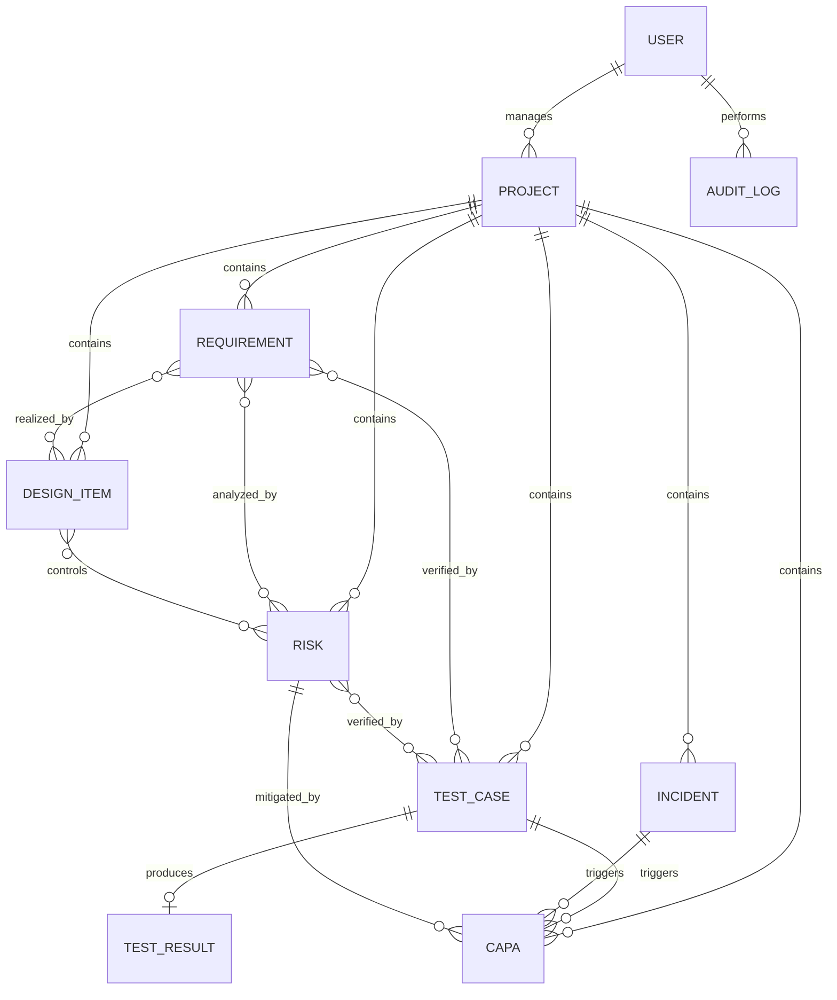

# MedTrace RA

현재 버전: **1.0.0**

## 버전 관리

실제 애플리케이션 동작 로직, API 동작 또는 데이터 처리 로직이 변경될 때만 `VERSION` 파일의 버전을 올립니다. 문서, 주석, 오타, 코드 포맷 및 CSS만 변경하는 경우에는 버전을 유지합니다.

- PATCH (`1.0.0` → `1.0.1`): 버그 수정과 문서 보완
- MINOR (`1.0.0` → `1.1.0`): 하위 호환 기능 추가
- MAJOR (`1.0.0` → `2.0.0`): 호환되지 않는 구조·API 변경

로직 변경 커밋 메시지에는 대상 버전을 포함하고, 기능 구현과 버전 변경을 같은 커밋으로 관리합니다.

의료기기 개발 과정의 요구사항, 설계, 위험, 시험, 이상사례 및 CAPA를 연결해 추적성 갭을 보여주는 Django 5 기반 포트폴리오용 MVP입니다. 모든 포함 데이터는 가상이며 실제 인허가·의료 판단을 대신하지 않습니다.

## 빠른 확인

- 기술 스택: Python, Django 5, Django REST Framework, SQLite
- 기본 언어·시간대: 한국어, `Asia/Seoul`
- 인증 방식: 웹 세션 및 API 세션/Basic 인증
- 보고서 형식: DOCX, XLSX, PDF
- 라이선스: 별도 라이선스 파일이 없으므로 재사용·배포 전 저장소 소유자에게 허용 범위를 확인해야 합니다.

## 주요 기능

- 프로젝트별 요구사항·설계·위험·시험·이상사례·CAPA CRUD
- `REQ-001`, `RISK-001`, `TEST-001`, `CAPA-001` 형식의 프로젝트별 자동 ID
- 발생가능성 × 심각도 위험 점수와 잔여 위험 자동 계산
- 승인 요구사항 시험 커버리지와 추적성 갭 탐지
- FAIL 시험의 CAPA 미연결, 미등록 시험 결과, 위험 미연결 경고
- 실제 DB 기반 대시보드와 추적성 매트릭스
- DOCX, XLSX, PDF 추적성 보고서 출력
- 세션 인증 REST API, 역할 그룹, 관리자 감사 로그
- 가상 웨어러블 모니터 데모 데이터 명령

## 설치 및 실행 (Windows PowerShell)

```powershell
python -m venv .venv
.venv\Scripts\Activate.ps1
python -m pip install --upgrade pip
pip install -r requirements.txt
python manage.py migrate
python manage.py seed_demo_data
python manage.py runserver
```

브라우저에서 `http://127.0.0.1:8000`을 엽니다. 데모 관리자 계정은 `admin / MedTrace!2026`, 조회 계정은 `viewer / Demo!2026`입니다. 공개 배포 전 반드시 비밀번호와 `SECRET_KEY`를 변경하세요.

테스트: `python manage.py test`

### 데모 계정

`seed_demo_data`는 아래 계정을 생성하거나 비밀번호를 초기화합니다. 실제 데이터가 있는 환경이나 공개 서버에서는 실행하지 마세요.

| 계정 | 비밀번호 | 역할 |
|---|---|---|
| `admin` | `MedTrace!2026` | 시스템 관리자 |
| `ra_manager` | `Demo!2026` | RA 항목 편집 |
| `developer` | `Demo!2026` | 요구사항·설계 편집 |
| `tester` | `Demo!2026` | 시험·결과 편집 |
| `viewer` | `Demo!2026` | 조회 전용 |

## 관리자 계정

비밀번호를 소스나 README에 저장하지 말고 명령 옵션 또는 환경 변수로 전달합니다.

```powershell
python manage.py create_admin --username admin --email admin@example.com --password "안전한-비밀번호"
python manage.py promote_admin --username viewer
python manage.py createsuperuser
```

환경 변수 기반 실행은 `ADMIN_USERNAME`, `ADMIN_EMAIL`, `ADMIN_PASSWORD`를 설정한 뒤 `python manage.py create_admin`을 사용합니다. 비밀번호가 비어 있으면 계정을 생성하지 않습니다. 운영 환경에서는 최초 로그인 후 비밀번호를 교체하고 `/admin/`에서 계정 상태를 확인하세요.

기존 계정을 직접 승격해야 한다면 `python manage.py shell`에서 `is_staff`, `is_superuser`, `is_active`를 `True`로 저장하고 `ADMIN` 그룹을 추가할 수 있습니다. 일반적으로는 감사 가능한 `promote_admin` 명령을 권장합니다.

## 역할

- ADMIN: 전체 관리와 감사 로그
- RA_MANAGER: RA 항목 관리
- DEVELOPER: 요구사항·설계 편집
- TESTER: 시험·결과 편집
- VIEWER: 조회 전용

## 주요 화면과 URL

| 화면 | URL |
|---|---|
| 대시보드 | `/` |
| 프로젝트 | `/projects/` |
| 각 업무 목록 | `/items/{requirements\|designs\|risks\|tests\|incidents\|capas}/` |
| 추적성 | `/traceability/` |
| 감사 로그 | `/audit/` |
| DOCX·XLSX·PDF 내보내기 | `/export/{docx\|xlsx\|pdf}/` |
| 관리자 | `/admin/` |
| API 루트 | `/api/` |

API에는 `/api/auth/login/`, `/api/auth/logout/`, `/api/projects/`, `/api/requirements/`, `/api/risks/`, `/api/tests/`, `/api/tests/{id}/result/`, `/api/incidents/`, `/api/capa/`, `/api/traceability/`, `/api/traceability/gaps/`, `/api/dashboard/summary/`가 포함됩니다.

API는 인증된 사용자만 사용할 수 있습니다. 브라우저에서 로그인한 세션을 사용하거나 개발 환경에서 Basic 인증으로 확인할 수 있습니다.

```powershell
curl.exe -u viewer:Demo!2026 http://127.0.0.1:8000/api/dashboard/summary/
curl.exe -u viewer:Demo!2026 http://127.0.0.1:8000/api/traceability/gaps/
```

조회(`GET`, `HEAD`, `OPTIONS`)는 모든 인증 사용자에게 허용됩니다. 데이터 변경은 `ADMIN`, `RA_MANAGER`, `DEVELOPER`, `TESTER` 그룹에 허용되며, 사용자 관리 API(`/api/admin/users/`)와 감사 로그는 관리자 전용입니다.

## 아키텍처와 추적성 데이터 구조

화면과 API가 동일한 Django ORM/서비스 계층을 사용합니다. SQLite가 기본이며 배포 환경에서는 `DATABASES` 설정을 PostgreSQL 백엔드로 바꿀 수 있습니다.



## 환경 변수

`.env.example`을 참고하세요. 현재 MVP는 OS 환경 변수를 직접 읽으며, 실제 `.env`는 커밋하지 않습니다. `DATABASE_URL`과 선택적 AI 키는 향후 운영 확장을 위한 자리이며 자동 규제 판단 기능은 구현하지 않았습니다.

현재 코드에서 실제로 사용하는 값은 `SECRET_KEY`, `DEBUG`, `ALLOWED_HOSTS`, `MAX_UPLOAD_SIZE_MB`, `ADMIN_USERNAME`, `ADMIN_EMAIL`, `ADMIN_PASSWORD`입니다. `.env` 파일은 자동으로 로드되지 않으므로 PowerShell 세션에서는 다음처럼 지정합니다.

```powershell
$env:SECRET_KEY = "충분히-길고-무작위인-값"
$env:DEBUG = "False"
$env:ALLOWED_HOSTS = "medtrace.example.com"
python manage.py runserver
```

`DATABASE_URL`, `OPENAI_API_KEY`, `AI_FEATURE_ENABLED`는 예시 파일에만 예약되어 있으며 현재 애플리케이션 동작에는 연결되어 있지 않습니다. 기본 데이터베이스는 프로젝트 루트의 `db.sqlite3`입니다.

## 프로젝트 구조

| 경로 | 설명 |
|---|---|
| `config/` | Django 설정, 루트 URL, ASGI/WSGI 진입점 |
| `core/` | 도메인 모델, 화면, API, 권한, 보고서 및 관리 명령 |
| `templates/` | Django HTML 템플릿 |
| `static/` | CSS와 정적 자산 |
| `core/tests.py` | 핵심 흐름, 권한, API, 보고서 회귀 테스트 |

## 운영 전 체크리스트

- `DEBUG=False`와 고유한 `SECRET_KEY`, 정확한 `ALLOWED_HOSTS`를 설정합니다.
- `seed_demo_data`로 만든 계정과 고정 비밀번호를 제거하거나 모두 교체합니다.
- HTTPS, 보안 쿠키, CSRF 신뢰 출처, 정적 파일 제공 방식을 배포 환경에 맞게 설정합니다.
- SQLite 대신 운영용 데이터베이스와 백업·복구 절차를 준비합니다.
- 전자서명, 감사 추적 보존, 접근권한 검토 등 적용 규정의 요구사항을 별도로 검증합니다.

## 제한 및 개선 방향

이 버전은 포트폴리오 MVP입니다. 변경요청 전용 워크플로, 전자서명, 파일 악성코드 검사, 세분화된 객체 권한, PostgreSQL 연결, 규제기관 제출 양식은 후속 확장 대상입니다. AI가 추가되더라도 초안 생성만 제공하고 담당자의 검토·승인을 필수로 해야 합니다.

> 본 시스템은 의료기기 개발 및 RA 문서관리 절차를 학습하고 시연하기 위한 포트폴리오용 시스템입니다. 실제 의료기기 인허가 승인, 이상사례 보고 여부 판단, 의료적 진단 또는 규제 전문가의 검토를 대체하지 않습니다.

