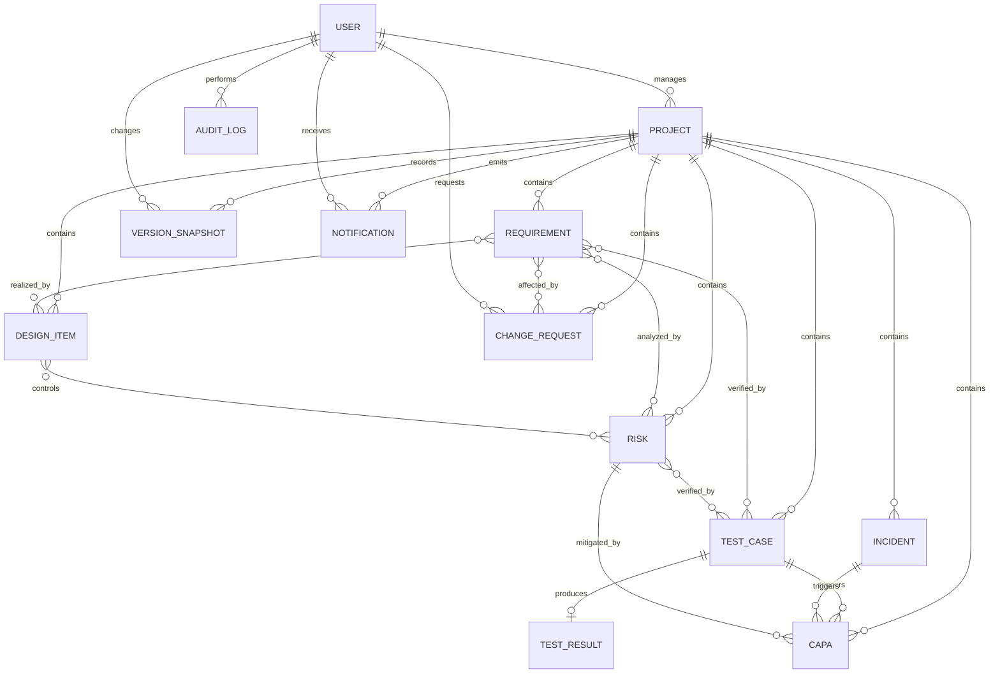

# MedTrace RA

의료기기 개발 과정의 요구사항, 설계, 위험, 시험, 이상사례, CAPA를 하나의 흐름으로 연결해 추적하는 Django 기반 RA(규제 대응) 관리 MVP입니다.

> 이 프로젝트는 학습 및 시연용입니다. 실제 의료기기 인허가, 의료적 판단 또는 규제 전문가의 검토를 대체하지 않습니다.

현재 버전: **1.0.0**

## 주요 기능

- 프로젝트별 요구사항·설계·위험·시험·이상사례·CAPA CRUD
- `REQ-001`, `DES-001`, `RISK-001`, `TEST-001`, `INC-001`, `CAPA-001` 형식의 자동 식별자
- 발생가능성과 심각도에 따른 위험 점수 및 위험 등급 계산
- 잔여 위험 점수와 수용 여부 관리
- 승인 요구사항의 시험 커버리지 계산
- 다음 추적성 누락 자동 탐지
  - 승인 요구사항과 시험의 미연결
  - 요구사항과 위험의 미연결
  - 시험 결과 미등록
  - FAIL 시험과 CAPA의 미연결
- 프로젝트 대시보드와 추적성 매트릭스
- DOCX, XLSX, PDF 추적성 보고서 출력
- 역할 기반 화면 및 REST API 접근 제어
- 관리자 전용 사용자·권한 관리 화면(`/users/`)
- 변경 요청 승인·반려, 담당자 알림 및 수정 전 버전 스냅샷
- 코드·제목·내용 통합 검색과 상태 필터
- 요구사항 Excel 가져오기(`/requirements/import/`)
- 프로젝트별 API 필터와 페이지네이션
- 관리자 전용 감사 로그(POST·PUT·PATCH·DELETE 기록)
- 재현 가능한 데모 데이터 생성 명령

## 기술 구성

- Python 3
- Django 5
- Django REST Framework
- SQLite
- Django Template 및 정적 CSS
- `python-docx`, `openpyxl`, `reportlab`

기본 언어는 한국어이고 시간대는 `Asia/Seoul`입니다.

## 빠른 시작

### Windows PowerShell

```powershell
python -m venv .venv
.venv\Scripts\Activate.ps1
python -m pip install --upgrade pip
pip install -r requirements.txt
python manage.py migrate
python manage.py seed_demo_data
python manage.py runserver
```

브라우저에서 <http://127.0.0.1:8000>에 접속합니다.

### macOS / Linux

```bash
python3 -m venv .venv
source .venv/bin/activate
python -m pip install --upgrade pip
pip install -r requirements.txt
python manage.py migrate
python manage.py seed_demo_data
python manage.py runserver
```

## 데모 계정

`seed_demo_data`는 다음 계정과 예시 프로젝트를 생성합니다.

| 계정 | 비밀번호 | 역할 |
|---|---|---|
| `admin` | `MedTrace!2026` | 시스템 관리자 |
| `ra_manager` | `Demo!2026` | 업무 데이터 조회·편집 |
| `developer` | `Demo!2026` | 업무 데이터 조회·편집 |
| `tester` | `Demo!2026` | 업무 데이터 조회·편집 |
| `viewer` | `Demo!2026` | 조회 전용 |

데모 명령은 기존 계정의 비밀번호도 위 값으로 초기화합니다. 실제 데이터가 있거나 외부에 공개된 환경에서는 실행하지 마세요.

## 역할과 권한

| 그룹 | 권한 |
|---|---|
| `ADMIN` | 전체 편집, 사용자·권한 관리, 사용자 조회 API, 감사 로그 접근 |
| `RA_MANAGER` | 업무 데이터 조회 및 편집 |
| `DEVELOPER` | 업무 데이터 조회 및 편집 |
| `TESTER` | 업무 데이터 조회 및 편집 |
| `VIEWER` | 조회 전용 |

REST API는 인증된 사용자만 사용할 수 있습니다. 조회 요청은 모든 인증 사용자에게 허용되며, 변경 요청은 관리자 또는 편집 그룹에만 허용됩니다. 일반 사용자는 화면에서도 생성·수정·삭제 버튼이 숨겨지고 `조회 전용`으로 표시됩니다.

관리자는 `/users/`에서 사용자를 생성하고 역할과 계정 활성 상태를 변경할 수 있습니다. 현재 로그인한 관리자가 실수로 자신의 관리자 권한을 제거하거나 계정을 비활성화하는 작업은 차단됩니다.

## 주요 화면

| 화면 | URL |
|---|---|
| 대시보드 | `/` |
| 프로젝트 | `/projects/` |
| 요구사항 | `/requirements/` 또는 `/items/requirements/` |
| 요구사항 Excel 가져오기 | `/requirements/import/` |
| 설계 | `/items/designs/` |
| 위험 | `/risks/` |
| 시험 | `/tests/` |
| 이상사례 | `/incidents/` |
| CAPA | `/capa/` |
| 추적성 매트릭스 | `/traceability/` |
| 변경 요청 | `/items/changes/` |
| 알림 | `/notifications/` |
| 감사 로그 | `/audit/` |
| 사용자·권한 관리 | `/users/` |
| Django 관리자 | `/admin/` |

보고서는 `/export/xlsx/`, `/export/docx/`, `/export/pdf/`에서 내려받을 수 있습니다. `project` 쿼리 파라미터를 생략하면 첫 번째 프로젝트를 사용합니다.

## REST API

API 기본 경로는 `/api/`입니다.

| 기능 | 경로 |
|---|---|
| 로그인·로그아웃 | `/api/auth/login/`, `/api/auth/logout/` |
| 프로젝트 | `/api/projects/` |
| 요구사항 | `/api/requirements/` |
| 위험 | `/api/risks/` |
| 시험 | `/api/tests/` |
| 시험 결과 등록 | `/api/tests/{id}/result/` |
| 이상사례 | `/api/incidents/` |
| CAPA | `/api/capa/` |
| 변경 요청 | `/api/changes/` |
| 추적성 | `/api/traceability/` |
| 추적성 누락 | `/api/traceability/gaps/` |
| 대시보드 요약 | `/api/dashboard/summary/` |
| 사용자 조회(관리자) | `/api/admin/users/` |

세션 인증과 Basic 인증을 지원합니다.

```powershell
curl.exe -u viewer:Demo!2026 http://127.0.0.1:8000/api/dashboard/summary/
curl.exe -u viewer:Demo!2026 http://127.0.0.1:8000/api/traceability/gaps/
```

## 데이터 관계


```mermaid
erDiagram
  USER ||--o{ PROJECT : manages
  PROJECT ||--o{ REQUIREMENT : contains
  PROJECT ||--o{ DESIGN_ITEM : contains
  PROJECT ||--o{ RISK : contains
  PROJECT ||--o{ TEST_CASE : contains
  PROJECT ||--o{ INCIDENT : contains
  PROJECT ||--o{ CAPA : contains
  PROJECT ||--o{ CHANGE_REQUEST : contains
  PROJECT ||--o{ VERSION_SNAPSHOT : records
  PROJECT ||--o{ NOTIFICATION : emits
  REQUIREMENT }o--o{ DESIGN_ITEM : realized_by
  REQUIREMENT }o--o{ RISK : analyzed_by
  REQUIREMENT }o--o{ TEST_CASE : verified_by
  DESIGN_ITEM }o--o{ RISK : controls
  RISK }o--o{ TEST_CASE : verified_by
  TEST_CASE ||--o| TEST_RESULT : produces
  TEST_CASE ||--o{ CAPA : triggers
  INCIDENT ||--o{ CAPA : triggers
  RISK ||--o{ CAPA : mitigated_by
  REQUIREMENT }o--o{ CHANGE_REQUEST : affected_by
  USER ||--o{ CHANGE_REQUEST : requests
  USER ||--o{ VERSION_SNAPSHOT : changes
  USER ||--o{ NOTIFICATION : receives
  USER ||--o{ AUDIT_LOG : performs
```

화면과 API는 동일한 Django ORM 모델 및 서비스 계산 로직을 사용합니다. `VERSION_SNAPSHOT`은 여러 업무 모델을 `model_name`과 `object_id`로 참조하므로 ERD에 개별 외래키 선은 표시하지 않습니다.

## 관리자 계정 생성

비밀번호를 저장소나 명령 기록에 남기지 않도록 환경 변수를 사용할 수 있습니다.

```powershell
$env:ADMIN_USERNAME = "admin"
$env:ADMIN_EMAIL = "admin@example.com"
$env:ADMIN_PASSWORD = "충분히-긴-비밀번호"
python manage.py create_admin
```

기존 사용자를 관리자로 승격하려면 다음 명령을 사용합니다.

```powershell
python manage.py promote_admin --username username
```

## 환경 변수

| 변수 | 기본값 | 설명 |
|---|---|---|
| `SECRET_KEY` | 개발용 키 | Django 비밀 키 |
| `DEBUG` | `True` | 디버그 모드 |
| `ALLOWED_HOSTS` | `127.0.0.1,localhost,testserver` | 허용 호스트 목록 |
| `MAX_UPLOAD_SIZE_MB` | `10` | 업로드 크기 제한 예약 값 |
| `ADMIN_USERNAME` | 없음 | 관리자 생성 명령용 계정 |
| `ADMIN_EMAIL` | 없음 | 관리자 생성 명령용 이메일 |
| `ADMIN_PASSWORD` | 없음 | 관리자 생성 명령용 비밀번호 |

`.env.example`에는 향후 확장용 값도 포함되어 있지만, 현재 애플리케이션은 `.env` 파일을 자동으로 읽지 않습니다. 운영 시에는 OS 또는 배포 플랫폼의 환경 변수로 값을 주입하세요.

## 테스트

```powershell
python manage.py check
python manage.py makemigrations --check --dry-run
python manage.py migrate --noinput
python manage.py test
```

현재 테스트는 로그인, 자동 식별자, 위험 계산, 추적성 누락, CAPA 기한, 보고서 출력, API 인증, 검색, Excel 가져오기, 변경 요청과 버전 이력, 목록 화면, 관리자 명령 및 역할 권한을 검증합니다. 현재 테스트 수는 17개이며 `python manage.py test`로 실행합니다.

## 프로젝트 구조

```text
config/                  Django 설정, 루트 URL, ASGI/WSGI
core/models.py           도메인 모델과 계산 속성
core/services.py         대시보드 및 추적성 계산
core/views.py            웹 화면과 보고서 출력
core/api.py              REST API
core/permissions.py      역할 기반 접근 제어
core/management/commands 관리 및 데모 데이터 명령
core/tests.py            통합 테스트
templates/               Django HTML 템플릿
static/                  CSS 등 정적 파일
```

## 운영 전 확인 사항

- `DEBUG=False`, 고유한 `SECRET_KEY`, 정확한 `ALLOWED_HOSTS`를 설정합니다.
- 데모 계정을 삭제하고 모든 고정 비밀번호를 교체합니다.
- HTTPS, 보안 쿠키, CSRF 신뢰 출처, 정적·미디어 파일 제공 방식을 설정합니다.
- SQLite 대신 운영용 데이터베이스와 백업·복구 절차를 준비합니다.
- 역할별 객체 권한과 승인 워크플로를 조직 규정에 맞게 확장합니다.
- 변경 전후 값, 전자서명, 감사 추적 보존 정책을 추가 검증합니다.
- 보고서 형식과 한글 폰트를 제출 기관 요구사항에 맞게 점검합니다.

## 구현 현황

| 기능 | 현재 상태 |
|---|---|
| 변경 요청 | 기본 등록, 상태 변경, 요구사항 연결 구현 |
| 알림 | 변경 요청 담당자·프로젝트 관리자 화면 알림 구현 |
| 버전 이력 | 웹 화면에서 항목 수정 전 JSON 스냅샷 저장 |
| 검색·필터 | 코드·제목·내용 검색과 상태 필터 구현 |
| Excel 가져오기 | 요구사항 XLSX 가져오기 구현 |
| API 개선 | 프로젝트 필터, 페이지네이션, 변경 요청 API 구현 |
| 권한 관리 | 관리자·편집 역할·조회 전용 사용자 구분 및 관리자 화면 구현 |
| 품질 자동화 | GitHub Actions에서 Django 테스트 실행 |
| 승인 워크플로 | 변경 요청의 승인·반려만 기본 구현, 전자서명은 미구현 |
| 이메일 알림·파일 관리 | 미구현 |

## 향후 개발 로드맵

현재 버전은 학습 및 시연용 MVP입니다. 아래 항목에는 일부 구현된 기능의 고도화 작업과 아직 구현되지 않은 기능이 함께 포함됩니다.

### 1. 승인 워크플로

- 업무 항목에 `초안 → 검토 중 → 승인 → 폐기` 상태 흐름 적용
- 검토자, 승인자, 승인일, 검토 의견 기록
- 승인된 항목의 직접 수정 제한
- 수정이 필요할 경우 새 버전 또는 변경 요청 생성

### 2. 감사 추적 강화

- 변경 전후 값과 변경 사유 저장
- 생성, 수정, 삭제, 승인, 로그인 이벤트 구분
- 사용자·기간·업무 항목별 감사 로그 검색
- 감사 기록의 일반 사용자 수정 및 삭제 차단

### 3. 파일 및 문서 관리

- 요구사항, 시험, 이상사례, CAPA별 증빙파일 첨부
- 파일 버전, 업로드 사용자, 업로드 일시, 체크섬 기록
- 시험성적서와 규제 제출 문서 연결
- 허용 확장자, 파일 크기, 악성 파일 검사 정책 적용

### 4. 권한 세분화

- 프로젝트별 사용자와 역할 배정
- 개발자, 시험자, RA 담당자의 편집 범위 분리
- 승인자와 작성자의 역할 분리
- 화면 권한과 API 객체 권한을 동일한 정책으로 적용

### 5. 추적성 품질 개선

- 설계가 연결되지 않은 요구사항 탐지
- 고위험 항목의 시험 누락 경고
- FAIL 시험과 CAPA 처리상태 연계
- 프로젝트별 추적성 완성도 점수 제공
- 미해결 추적성 누락의 대시보드 알림

### 6. 운영 안정성

- PostgreSQL 운영 데이터베이스 지원
- `.env` 또는 배포 플랫폼 기반 환경 설정
- 자동 백업 및 복구 절차
- GitHub Actions 기반 검사와 테스트 자동화
- 구조화된 애플리케이션 로그와 오류 모니터링

### 7. 알림 시스템

- CAPA 마감 임박 및 기한 초과 알림
- 시험 FAIL 발생 알림
- 승인 요청, 승인 및 반려 알림
- 애플리케이션 화면 알림과 선택적 이메일 발송

### 8. 변경 요청 관리

- 변경 사유, 영향 범위, 요청자, 담당자 기록
- 관련 요구사항, 설계, 위험 및 시험 자동 연결
- 검토와 승인 완료 전 변경 적용 제한
- 변경 요청별 조치 상태와 완료 증빙 관리

### 9. 버전 비교

- 요구사항과 설계 문서의 이전 버전 비교
- 추가, 수정, 삭제된 필드 강조
- 승인 이후 발생한 변경 내역 표시
- 버전별 승인 상태와 적용 시점 기록

### 10. 프로젝트 현황 분석

- 요구사항, 시험 및 CAPA 진행률 차트
- 담당자별 미처리 항목 집계
- 월별 이상사례와 위험 추이
- 분석용 CSV 및 XLSX 데이터 출력

### 11. 검색과 필터

- 코드, 제목, 상태 및 담당자 통합 검색
- 고위험, 기한 초과 및 미연결 항목 빠른 필터
- 프로젝트별 검색 범위 제한
- 자주 사용하는 검색 조건 저장

### 12. 데이터 가져오기

- 기존 Excel 요구사항 및 위험 목록 업로드
- 시험 결과와 CAPA 일괄 등록
- 실제 반영 전 데이터 검증과 오류 미리보기
- 업로드 결과와 실패 항목 보고서 제공

### 13. API 개선

- 프로젝트 및 사용자별 쿼리셋 격리
- 페이지네이션, 검색, 필터 및 정렬
- OpenAPI 및 Swagger 문서 제공
- 운영용 API 토큰, 만료 정책 및 호출 제한

### 14. 품질 자동화

- GitHub Actions 기반 자동 테스트
- 코드 포맷과 정적 분석 검사
- 의존성 및 보안 취약점 검사
- 테스트 커버리지 측정과 결과 표시

### 권장 후속 구현 순서

기본 변경 요청, 화면 알림, 버전 스냅샷과 요구사항 Excel 가져오기는 구현되었습니다. 다음 단계는 `승인 전자서명 → 감사 추적 상세화 → 프로젝트별 객체 권한 → 파일·문서 관리 → 운영 데이터베이스와 백업` 순서를 권장합니다.

### 추가 개발 우선순위와 완료 기준

#### P1. 승인 전자서명과 잠금

- 승인 시 현재 사용자 비밀번호를 다시 확인합니다.
- 승인자, 승인 시각, 승인 의견과 대상 버전을 저장합니다.
- 승인된 업무 항목은 직접 수정하지 못하며 변경 요청을 통해서만 수정합니다.
- 작성자와 승인자를 분리할 수 있도록 권한을 검증합니다.

완료 기준: 승인 기록이 감사 로그와 버전 이력에서 재현되고, 승인 후 직접 수정 요청이 화면과 API 모두에서 차단되어야 합니다.

#### P1. 프로젝트별 접근 제어

- 사용자와 프로젝트 사이의 소속 및 역할 관계를 추가합니다.
- 사용자는 배정된 프로젝트만 조회하거나 편집할 수 있습니다.
- 시스템 관리자만 프로젝트 사용자 배정을 변경합니다.
- 웹 화면과 REST API에 동일한 객체 권한 정책을 적용합니다.

완료 기준: 다른 프로젝트의 URL이나 API ID를 직접 입력해도 데이터가 노출되지 않아야 합니다.

#### P1. 감사 추적 상세화

- 생성, 수정, 삭제, 승인, 반려, 로그인 이벤트를 구분합니다.
- 변경 전후 값, 변경 사유, 사용자, IP, 발생 시각을 기록합니다.
- 프로젝트, 사용자, 기간, 이벤트 종류별 검색을 제공합니다.
- 감사 기록은 일반 사용자와 업무 담당자가 수정하거나 삭제할 수 없게 합니다.

완료 기준: 주요 업무 항목의 변경 과정을 감사 로그만으로 재구성할 수 있어야 합니다.

#### P2. 증빙 파일과 문서 관리

- 요구사항, 시험, 이상사례, CAPA에 파일을 첨부합니다.
- 파일 버전, 업로더, 업로드 시각, 크기와 체크섬을 기록합니다.
- 허용 확장자와 최대 크기를 검증하고 안전한 다운로드 권한을 적용합니다.
- 교체된 파일도 감사 목적으로 보존합니다.

완료 기준: 파일 변경 이력과 업무 항목의 연결 관계를 추적할 수 있어야 합니다.

#### P2. 운영 알림

- CAPA 마감 임박과 기한 초과, 시험 FAIL, 승인 요청을 알립니다.
- 개별 읽음 처리와 알림 종류별 필터를 제공합니다.
- 선택적으로 이메일을 발송하며 중복 발송을 방지합니다.

완료 기준: 동일 이벤트가 중복 생성되지 않고 담당자에게만 전달되어야 합니다.

#### P2. Excel 가져오기 검증 강화

- 저장 전에 행별 미리보기와 검증 결과를 표시합니다.
- 오류 행 번호, 필드와 실패 원인을 제공합니다.
- 전체 취소 또는 정상 행만 반영하는 방식을 선택할 수 있게 합니다.
- 가져오기 결과 보고서를 XLSX로 내려받습니다.

완료 기준: 잘못된 파일이 데이터 일부를 예기치 않게 변경하지 않아야 합니다.

#### P3. API 문서와 운영 보안

- OpenAPI 스키마와 Swagger UI를 제공합니다.
- 검색, 정렬, 필터 파라미터를 문서화합니다.
- 운영용 토큰 만료, 폐기와 호출 제한 정책을 적용합니다.
- CI에서 의존성 취약점, 정적 분석과 테스트 커버리지를 검사합니다.

완료 기준: 인증 방식과 모든 공개 API를 문서만으로 재현할 수 있어야 합니다.

### 규제 환경 고려사항

전자서명, 승인 기록, 감사 추적, 데이터 무결성 및 기록 보존은 단순 기능 구현만으로 충족되지 않습니다. 실제 규제 환경에서는 조직의 SOP와 적용 규정에 따라 요구사항을 정의하고 시스템 검증을 수행해야 합니다. 필요한 경우 21 CFR Part 11, EU GMP Annex 11 및 적용 가능한 품질시스템 요구사항을 별도로 검토하세요.

## 버전 관리

실제 애플리케이션 로직이나 API 동작이 변경될 때만 `VERSION`을 갱신합니다.

- PATCH: 호환되는 버그 수정
- MINOR: 하위 호환 기능 추가
- MAJOR: 호환되지 않는 구조 또는 API 변경


## CI 검증

현재 테스트는 로그인, 자동 식별자, 위험 계산, 추적성 누락, CAPA 기한, 보고서 출력, API 인증, 목록 화면, 관리자 명령 및 역할 권한을 검증합니다.

GitHub Actions와 로컬 개발 환경은 [`.python-version`](.python-version)의 Python 3.12를 기준으로 합니다. CI는 외부 API 키 없이 실행되며 `DEBUG=False`, 테스트용 `SECRET_KEY`, `AI_FEATURE_ENABLED=False`를 명시합니다.

### CI 문제 해결 기록

- `Tests / test` 실패 원인은 감사 로그 데이터에 `model` 키가 없을 때 템플릿의 `default` 필터 인수를 해석하면서 발생한 `VariableDoesNotExist`였습니다.
- 감사 로그 제목을 명시적인 `` 분기로 처리하여 `code`와 `model` 키가 모두 없어도 안전하게 렌더링하도록 수정했습니다.
- CI에서 시스템 체크, 마이그레이션 누락 검사, 실제 마이그레이션 적용 후 테스트를 실행하도록 검증 단계를 강화했습니다.
